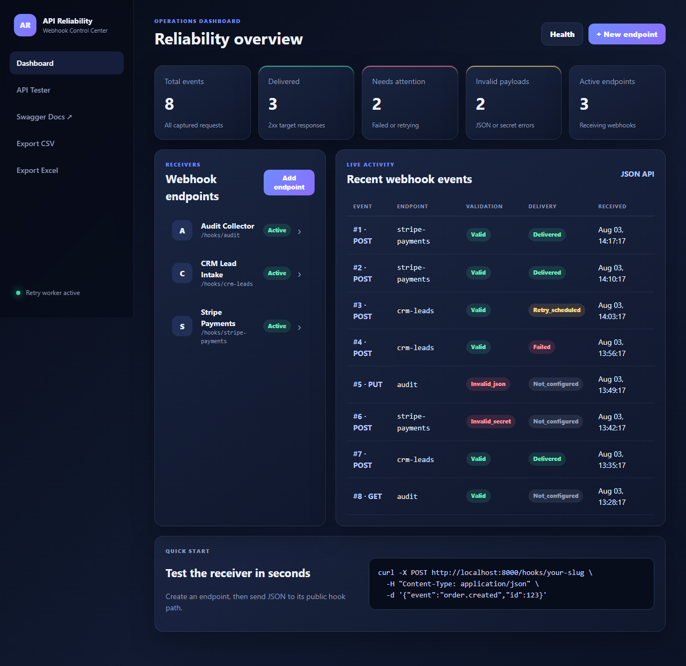

<a id="english"></a>

<div align="center">

**🇬🇧 English** · [🇷🇺 Русский](#russian)

</div>

# API & Webhook Reliability Monitor

A production-style FastAPI dashboard for receiving, inspecting, validating, forwarding, replaying, retrying, and exporting webhook events.



## Why this project exists

Webhook integrations often fail silently because of invalid JSON, expired secrets, temporary API outages, incorrect authentication, or unhandled non-2xx responses. This project provides a practical control center for troubleshooting those failures and replaying events without asking the original service to resend them.

## Features

- Create reusable webhook receiver URLs
- Capture method, headers, query parameters, content type, raw body, and parsed JSON
- Validate JSON payloads and optional `X-Webhook-Secret` authentication
- Forward events to a configured API endpoint
- Log HTTP status, response body, duration, and delivery attempts
- Automatically retry failed deliveries with exponential backoff
- Manually replay any stored webhook event
- Pause or resume individual endpoints
- Rotate webhook secrets
- Test arbitrary REST API requests from the web dashboard
- Searchable event history through JSON API endpoints
- Export webhook history to CSV and formatted Excel
- SQLite persistence
- Swagger/OpenAPI documentation
- Responsive dark dashboard UI
- Docker and Docker Compose support
- Automated tests

## Tech stack

- Python 3.12+
- FastAPI
- SQLAlchemy 2
- HTTPX
- Jinja2
- SQLite
- Pandas and OpenPyXL
- Uvicorn
- Pytest

## Quick start

```bash
git clone <your-repository-url>
cd api-webhook-reliability-monitor
python -m venv .venv
```

Activate the environment:

```bash
# Windows
.venv\Scripts\activate

# macOS / Linux
source .venv/bin/activate
```

Install and run:

```bash
pip install -r requirements.txt
python run.py
```

Open:

- Dashboard: `http://localhost:8000`
- Swagger docs: `http://localhost:8000/docs`
- Health check: `http://localhost:8000/health`

## Demo data

Create a polished demo database with sample endpoints, successful deliveries, invalid requests, failures, and scheduled retries:

```bash
python seed_demo.py
python run.py
```

## Docker

```bash
docker compose up --build
```

The SQLite database is persisted in a Docker volume.

## Example workflow

1. Create an endpoint called `Stripe Payments` with slug `stripe-payments`.
2. Optionally configure a target URL and webhook secret.
3. Send a request:

```bash
curl -X POST http://localhost:8000/hooks/stripe-payments \
  -H "Content-Type: application/json" \
  -H "X-Webhook-Secret: your-secret" \
  -d '{"type":"invoice.paid","data":{"id":"in_123"}}'
```

4. Inspect the event in the dashboard.
5. Review validation and delivery status.
6. Replay the payload after fixing the receiving API.
7. Export the incident history as CSV or Excel.

## Main routes

| Route | Purpose |
|---|---|
| `/` | Operations dashboard |
| `/hooks/{slug}` | Public webhook receiver |
| `/endpoints/{id}` | Endpoint settings and history |
| `/events/{id}` | Payload, headers, response, and delivery attempts |
| `/api-tester` | Manual REST API request tester |
| `/api/stats` | Dashboard metrics as JSON |
| `/api/events` | Recent webhook events as JSON |
| `/exports/events.csv` | CSV export |
| `/exports/events.xlsx` | Excel export |
| `/docs` | Swagger documentation |

## Retry behavior

A failed delivery is automatically scheduled for another attempt when:

- the endpoint has auto-forwarding enabled;
- the request passed validation;
- the target returned a non-2xx response or raised a network error;
- the endpoint has remaining retry attempts.

The delay grows exponentially from the endpoint's configured base delay. All attempts are stored for audit and troubleshooting.

## Environment variables

Copy `.env.example` or provide values through your shell/container:

```env
APP_NAME=API & Webhook Reliability Monitor
DATABASE_URL=sqlite:///./data/monitor.db
RETRY_POLL_SECONDS=5
REQUEST_TIMEOUT_SECONDS=15
DEMO_MODE=false
```

## Tests

```bash
pytest -q
```

The tests cover dashboard availability, endpoint creation, webhook capture, secret validation, JSON event pages, statistics, and CSV/Excel exports.

## Project structure

```text
app/
├── main.py          # FastAPI routes and application factory
├── models.py        # SQLAlchemy models
├── services.py      # Forwarding, retries, API testing, metrics
├── config.py        # Environment configuration
├── database.py      # Engine and session helpers
├── templates/       # Dashboard UI
└── static/          # CSS and JavaScript
tests/
seed_demo.py
run.py
Dockerfile
docker-compose.yml
```

## Portfolio description

> Developed a FastAPI-based reliability dashboard for receiving, inspecting, validating, and replaying webhook events. The application stores complete request history, detects failed API calls, retries unsuccessful deliveries with exponential backoff, provides a REST API testing console, and exports monitoring data to CSV and Excel.

## Skills demonstrated

`Python` · `FastAPI` · `REST API` · `Webhooks` · `API Integration` · `HTTPX` · `SQLAlchemy` · `SQLite` · `Pydantic` · `Jinja2` · `Pandas` · `Excel Automation` · `Docker` · `Pytest`

## Security notes

This is a portfolio-ready MVP. Before public production deployment, add user authentication, CSRF protection, encrypted secrets, HTTPS termination, rate limiting, and a production database such as PostgreSQL.

## License

MIT

---

<a id="russian"></a>

<div align="center">

[🇬🇧 English](#english) · **🇷🇺 Русский**

</div>

# API & Webhook Reliability Monitor — Русская версия

Production-style приложение на FastAPI для приёма, проверки, пересылки, повторной отправки и анализа webhook-событий.

## Зачем нужен проект

Webhook-интеграции часто ломаются из-за некорректного JSON, временно недоступного API, ошибок авторизации, просроченных секретов или ответов не из диапазона 2xx. Проект даёт единый центр, где можно увидеть событие, понять причину ошибки и повторить доставку без повторного запроса к исходному сервису.

## Возможности

- создание собственных webhook URL;
- сохранение method, headers, query-параметров, content type, raw body и JSON;
- проверка JSON и опционального `X-Webhook-Secret`;
- автоматическая пересылка событий на внешний API;
- логирование статуса ответа, тела ответа, времени и числа попыток;
- retry с exponential backoff;
- ручной replay любого события;
- pause/resume endpoint'ов;
- ротация webhook secrets;
- встроенный REST API tester;
- история событий и JSON API;
- экспорт в CSV и Excel;
- SQLite persistence;
- Swagger/OpenAPI;
- Docker / Docker Compose;
- автоматические тесты.

## Стек

Python 3.12+, FastAPI, SQLAlchemy 2, HTTPX, Jinja2, SQLite, Pandas, OpenPyXL, Uvicorn, Pytest.

## Быстрый запуск

```bash
python -m venv .venv
```

Windows:

```bat
.venv\Scripts\activate
pip install -r requirements.txt
python run.py
```

macOS / Linux:

```bash
source .venv/bin/activate
pip install -r requirements.txt
python run.py
```

Открыть:

- Dashboard: `http://localhost:8000`
- Swagger: `http://localhost:8000/docs`
- Health: `http://localhost:8000/health`

Для готовой демонстрации:

```bash
python seed_demo.py
python run.py
```

## Retry-логика

Неудачная доставка автоматически повторяется, если endpoint разрешает авто-пересылку, событие прошло валидацию, внешний сервис вернул ошибку/недоступен и лимит попыток ещё не исчерпан. Все попытки сохраняются для аудита.

## Что демонстрирует проект

Python backend, FastAPI, REST API, webhooks, надёжные интеграции, retries, observability, SQLAlchemy, экспорт данных, Docker и тестирование.
